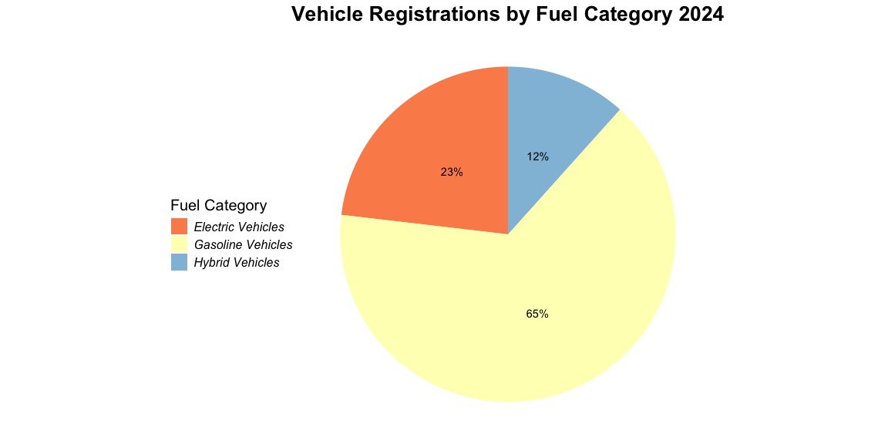
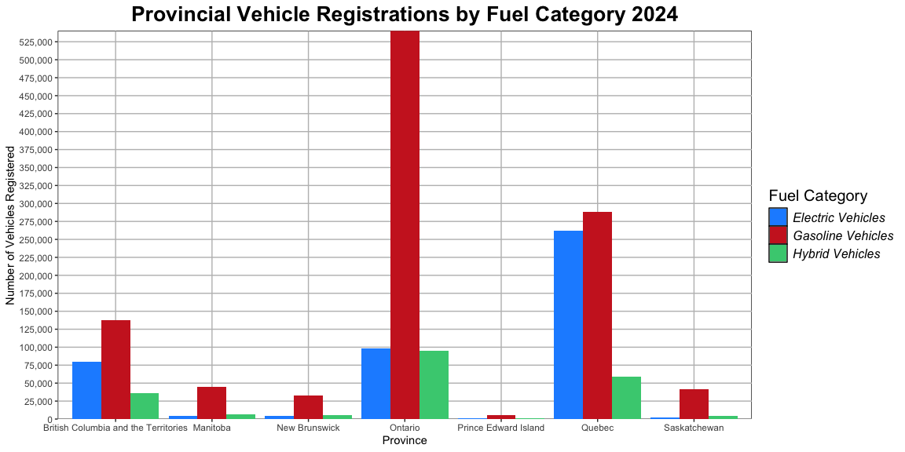
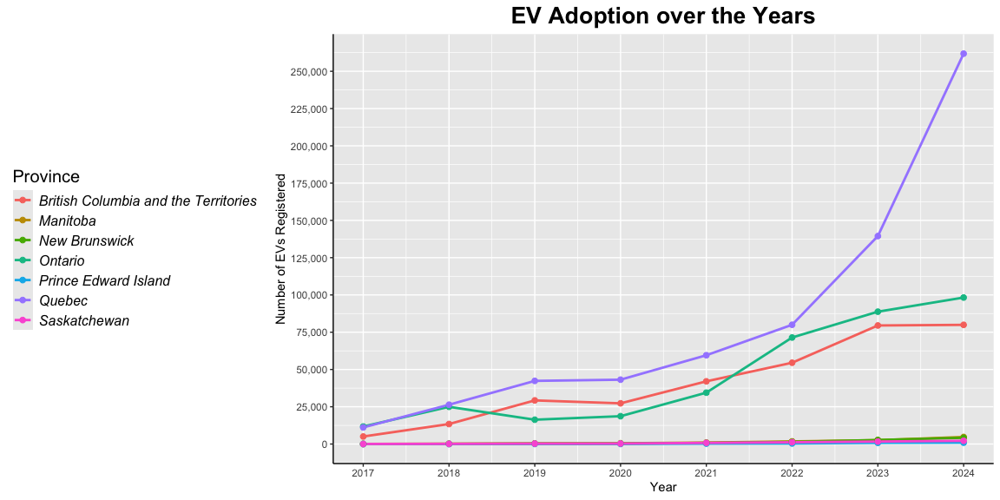
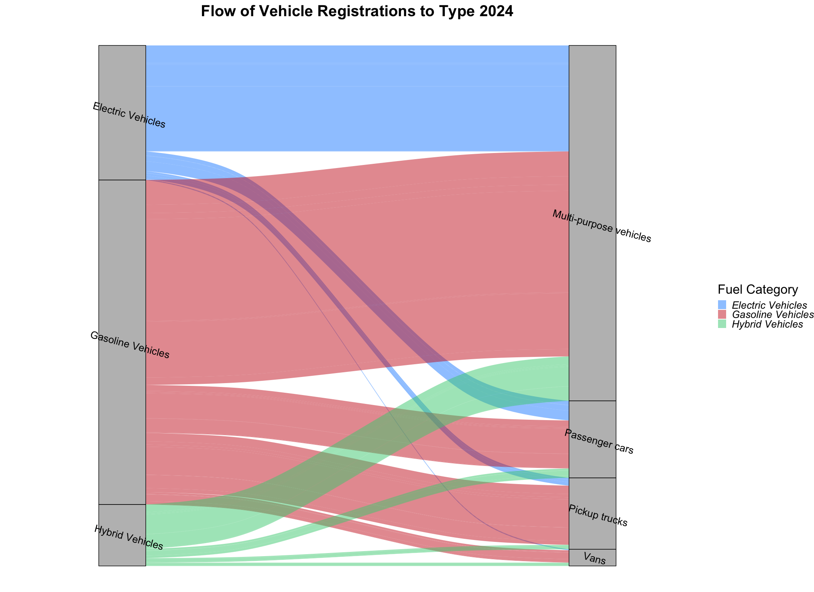
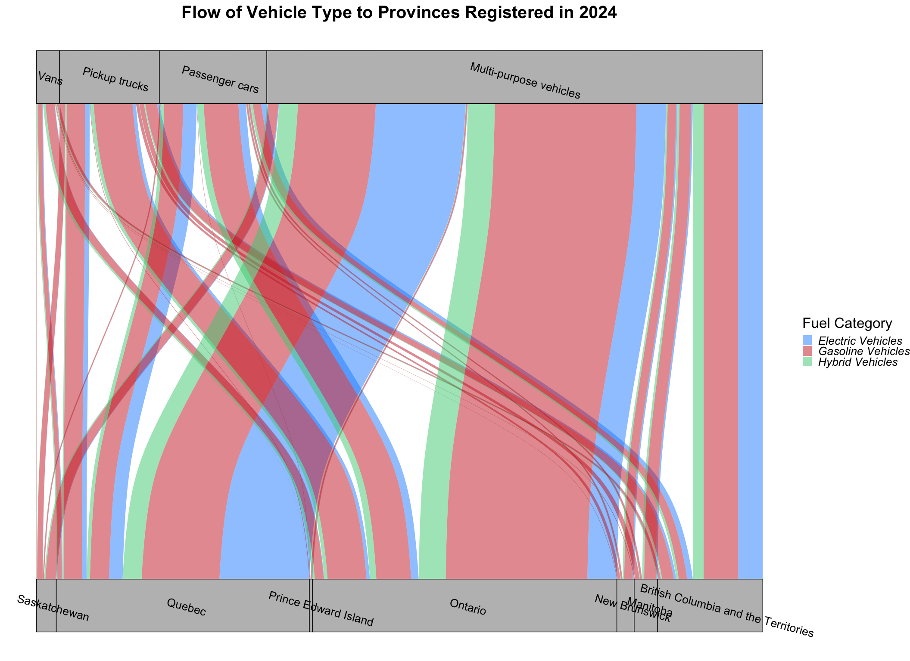
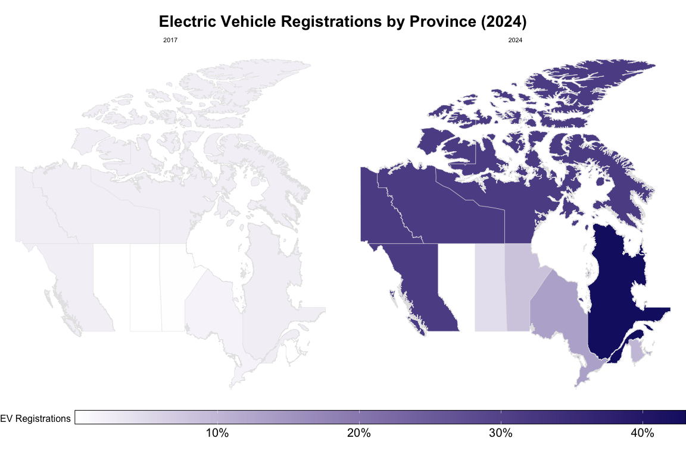

## Tracking Canada’s Adoption of Electric Vehicles

With the rising concern of climate change and prices of natural
resources such as gas and oil ballooning, the electric vehicle market is
on the rise. These upcoming charts will show us how the EV market has
been changing over the years and how the adoption rate differs across
the country. This data was collected from the government of Canada
called *New motor vehicle registrations, quarterly - Dataset*.

First, let’s examine the share each fuel type has on the market at the
beginning of 2025:

This pie chart provides a clear view of how the market is divided among
the categories at a national level. Currently, eco-friendly vehicle
options are at an adoption rate of about **35%** across the country.

What does this vehicle share look like across the country?

Here we compare each province’s vehicle share side by side, showing us
the magnitude in differences in each fuel type’s adoption. This
visualization helps highlight provinces where EV registrations only
contribute a small amount to the market, and subsequently suggests that
this is just a reflection of the low registrations in the province as a
whole.

Next, let’s try to understand how Canada has grown to this point:

If we take a look at our graph, one key consistency is the growth in EV
registrations after the year 2019. On **May 1st, 2019** the *iZEV*
program was introduced by the government of Canada to give citizens a
**$5000** rebate for any zero emission vehicle purchase. It’s clear the
impact incentives can have, and this has helped mitigate the higher
barrier of entry EVs pose when trying to purchase a vehicle.

Subsequently, we see the provinces Saskatchewan, PEI, and others unable
to scratch **10,000** EV registrations per year. We see highly populated
provinces like Ontario and British Columbia having their growth wane.
Maybe their vehicle market share has hit a plateau. Let’s take a look:

The first sankey plot shows us which fuel categories are most registered
in which vehicle types. The second plot shows us the volume of the
vehicle types being registered in each province. Understanding the
vehicle segments driving EV adoption is critical to see where
improvements are needed. These diagrams show us the success of
multi-purpose vehicles, particularly in Quebec, where EV adoption now
surpasses gasoline options. Conversely, we find that bigger vehicles
with more emissions are harder to electrify well because of factors like
**mileage, horsepower, and torque**. This highlights the impact that
technological readiness and suitability has on the adoption of EVs.

Finally, let’s look at the growth of EVs over time from a geographical
context.

This map visualizes the percentage of EV registrations across the
provinces and territories, offering a spatial perspective on the
regional disparities we have been exploring. Provinces and territories
where the EVs are starting to eat up market share are darker on the
color gradient. Conversely, the color gradient highlights the area with
lower registrations as lighter colors, giving a clear picture of where
additional EV infrastructure and incentives might be needed.

Overall we can conclude that while EV registrations are growing
nationwide, the pace and nature of their growth vary by region and
vehicle type. Factors like charging infrastructure, government
incentives, fuel economy, and time in the market all contribute to the
challenges of adopting EVs in different regions.
